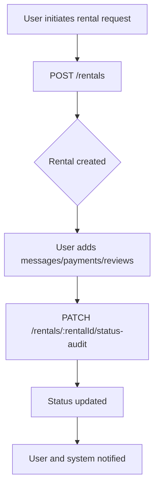
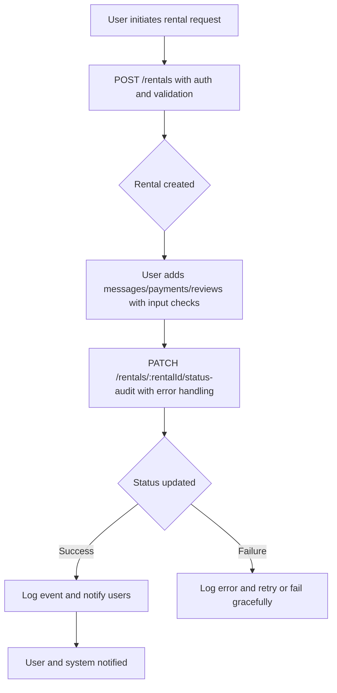

# Transaction Logic Refactoring Plan

## Introduction
This document outlines a detailed plan to review and refactor the user interaction flow in the backend API, focusing on transaction logic. The plan is based on the analysis of the `backend/src/routes.ts` file and aims to improve code maintainability, security, and reliability.

## Goal
The primary goal is to enhance the transaction logic by:
- Cleaning up dead code and organizing the API routes for better readability and maintenance.
- Adding safeguards such as error handling, logging, and input validation to ensure robustness and security.
- Providing visualizations to clarify the transaction flow before and after refactoring.

## Step 1: Cleanup
- **Objective**: Remove unnecessary code and improve code organization.
- **Actions**:
  - Identify and remove commented-out code (e.g., legacy functions) to reduce clutter.
  - Sort imports alphabetically and remove unused ones.
  - Group related routes logically (e.g., by functionality) for easier navigation.
- **Expected Outcome**: A cleaner, more maintainable codebase with fewer distractions and potential issues.

## Step 2: Additional Safeguards
- **Objective**: Add error handling, logging, and validation to enhance reliability and security.
- **Actions**:
  - Implement try-catch blocks and standardized error responses for critical operations like rental status updates and payments.
  - Add logging middleware to capture key events (e.g., status changes) for debugging and monitoring.
  - Integrate input validation to check user inputs (e.g., ensure rental requests have required fields) and prevent invalid data.
  - Strengthen security by ensuring all transaction routes use the `authenticateToken` middleware and adding checks for vulnerabilities (e.g., CSRF protection if applicable).
- **Expected Outcome**: More robust API with better error management, logging, and security, reducing the risk of failures and attacks.

## Mermaid Diagrams

### Current Transaction Flow

### Improved Transaction Flow

## Implementation Steps
1. **Review and Refactor**:
   - Examine `backend/src/routes.ts` to identify dead code and organize imports.
2. **Add Safeguards**:
   - Insert error handling, logging, and validation middleware.
   - Ensure all transaction routes are protected with authentication.
3. **Testing**:
   - Conduct thorough testing to verify that changes do not introduce regressions and that the API functions correctly.
4. **Documentation**:
   - Update any relevant documentation to reflect the changes.

## Conclusion
This plan provides a structured approach to refactoring the transaction logic in the backend API. By following these steps, we can improve the code's quality, security, and maintainability. If approved, we can proceed to implementation in the next steps.