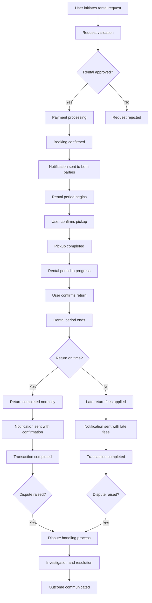

# Updated Transaction Logic Refactoring Plan

## Introduction
This document outlines an updated plan to review and refactor the user interaction flow in the backend API, focusing on transaction logic for equipment rentals. The plan incorporates detailed examples of dispute resolution, ensuring a comprehensive approach to the entire rental lifecycle, including initiation, confirmation, return procedures, and handling of issues like late returns and disputes. The goal is to provide a seamless, positive experience for both equipment owners and renters.

## Goal
The primary goal is to enhance the transaction logic by:
- Covering the full rental lifecycle from request to return.
- Including robust dispute resolution mechanisms.
- Ensuring user experience is prioritized at every step.
- Providing technical details for implementation.

## Step 1: Transaction Lifecycle Overview
The transaction lifecycle includes initiation, confirmation, rental period, return, and dispute handling. Below is a visual representation:

### Key Stages:
- **Initiation**: User submits a rental request with details.
- **Confirmation**: Booking is confirmed after validation and payment.
- **Rental Period**: Includes pickup, usage, and return.
- **Return**: Handling of on-time and late returns.
- **Dispute Resolution**: Addressing issues like payment failures, damage, or late returns.

## Step 2: Late Return Handling
- **Mechanism**: If a return is late, the system automatically calculates fees based on predefined rules (e.g., daily rate).
- **Notifications**: Automated emails or in-app notifications are sent to both parties.
- **User Experience**: Late renters receive reminders and are charged fairly, while owners are notified to confirm the fee.

## Step 3: User Experience Improvements
- **Initiation**: Simplified rental request form with clear instructions.
- **Confirmation**: Real-time notifications and dashboard updates.
- **Return**: Easy return confirmation process with status tracking.
- **Disputes**: User-friendly interface for reporting issues without technical barriers.

## Step 4: Technical Implementation Details
- **Database Changes**:
  - Add `rental_status` enum (e.g., pending, confirmed, in_progress, completed, disputed).
  - Include `expected_return_date`, `actual_return_date`, `late_fee_amount`, and `dispute_status` fields.
  - Add tables for disputes and messages to track communication.

- **API Endpoints**:
  - `POST /rentals`: Create rental request.
  - `GET /rentals/:id/status`: Retrieve rental status.
  - `PUT /rentals/:id/confirm-return`: Handle return confirmation, including late fees.
  - `POST /disputes`: Report a dispute (e.g., payment issue, damage).
  - `GET /disputes/:id`: Retrieve dispute details.
  - `PUT /disputes/:id/resolution`: Update dispute resolution.

- **Frontend Changes**:
  - Update web app to display rental status, late fees, and dispute options.
  - Implement dashboards for active rentals and dispute history.

## Step 5: Dispute Resolution Examples
- **Payment Issues**:
  - If a payment fails, the system flags it and sends a notification. Owners can escalate to admin for manual processing.
  - Example: User's card declines; dispute is logged, and alternative payment methods are suggested.

- **Equipment Damage**:
  - Renters report damage via the app. Admin reviews photos and rental terms to determine liability.
  - Example: Equipment is damaged; renter pays for repairs or the owner initiates a claim.

- **Late Returns**:
  - Late fees are applied automatically. If disputes arise, allow both parties to provide evidence.
  - Example: User claims late due to delay; system checks rental terms and calculates fair fees.

- **Escalation Process**:
  - All disputes go to admin for review within 24 hours.
  - Outcome is communicated via email, and penalties or refunds are applied.

## Summary
This updated plan ensures a comprehensive transaction flow with emphasis on dispute resolution, late returns, and user experience. By implementing these changes, the API will better handle real-world scenarios, improving reliability and satisfaction for all users.